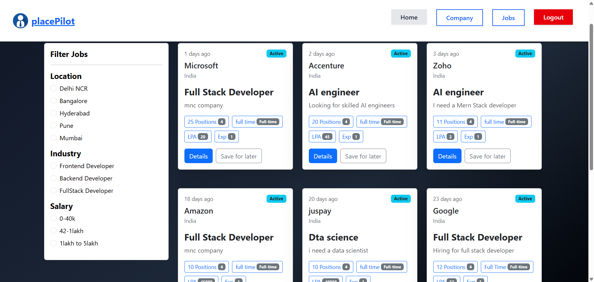

# 🧭 PlacePilot

### A placement management platform connecting students and recruiters for smooth and automated campus placements.

---

## 📚 Table of Contents
- [📝 Brief One Line Summary](#-brief-one-line-summary)
- [🌐 Overview](#-overview)
- [💭 Problem Statement](#-problem-statement)
- [📊 Dataset](#-dataset)
- [🧰 Tools and Technologies / Methods](#-tools-and-technologies--methods)
- [🔍 Key Insights](#-key-insights)
- [🧠 Model / Output](#-model--output)
- [⚙ How to Run This Project](#-how-to-run-this-project)
- [🏁 Result and Conclusion](#-result-and-conclusion)
- [🚀 Future Work](#-future-work)
- [👩‍💻 Author and Contact](#-author-and-contact)

---

## 📝 Brief One Line Summary
A full-stack web application where *admins can post job openings* and *students can apply and get notified*, simplifying campus placement workflows.

---

## 🌐 Overview
PlacePilot is designed to *digitize and streamline the placement process* between students and recruiters.  
It provides a *centralized platform* for:
- Admins to post opportunities, review resumes, and shortlist candidates.
- Students to view job postings, apply, and receive updates in real time.

---

## 💭 Problem Statement
Traditional campus placements rely on manual communication, spreadsheets, and emails, leading to:
- Poor coordination between recruiters and students  
- Missing opportunities due to lack of notifications  
- Difficulty in managing multiple job applications simultaneously  

PlacePilot solves these by offering an *automated and centralized placement system*.

---

## 📊 Dataset
PlacePilot uses a *MongoDB database* to store structured information:
- *Student Data:* Name, email, resume, skills, applications  
- *Company Data:* Company name, role, salary, location  
- *Job Posts:* Job details, eligibility, and deadlines  
- *Notifications:* Automatic updates to students and recruiters  

---

## 🧰 Tools and Technologies / Methods
| Layer | Technology / Tool |
|-------|--------------------|
| *Frontend* | React.js, Tailwind CSS |
| *Backend* | Node.js, Express.js |
| *Database* | MongoDB (Mongoose ORM) |
| *Authentication* | JWT (JSON Web Token) |
| *Version Control* | Git, GitHub |
| *Deployment* | Render |
| *Other Libraries* | Axios, Redux, Framer Motion, Sonner Toasts |

---

## 🔍 Key Insights
- Centralized system improved recruiter-student coordination  
- Automation reduced manual work for placement officers  
- User-friendly dashboard enhanced accessibility  
- Notifications increased student engagement  

---

## 🧠 Model / Output
### System Modules:
1. *Admin Panel:* Post jobs, manage applications, and view student resumes  
2. *Student Dashboard:* Apply for jobs, upload resumes, and track status  
3. *Authentication System:* Secure signup/login using JWT  

### Example Output:
| Page | Screenshot |
|------|-------------|
| Home Page |  |
| Opportunities Page |  |
| Student Dashboard |  |

---

## ⚙ How to Run This Project

1. *Clone the repository*
   ```bash
   git clone https://github.com/yourusername/place-pilot.git
   cd place-pilot

2. *Install Dependencies*
   ```bash
   npm install
   cd frontend
   npm install

3. *Add environment variables*

   MONGODB_URL ="your_mongodb_connection_string_here"   

   JWT_SECRET= "your_jwt_secret_here"

4. *Run the backend*
   ```bash
   npm start

5. *Run the frontend*
    npm run dev          


## 🏁 Result and Conclusion

PlacePilot successfully streamlines and automates the placement process between recruiters and students.  
It eliminates manual coordination by providing a centralized dashboard for both parties.

### ✅ Key Outcomes:
- Improved efficiency and transparency in campus placements  
- Real-time notifications for students  
- Easier job posting and selection process for recruiters  
- Enhanced visibility of student resumes and profiles  

Overall, *PlacePilot enhances communication, reduces workload, and ensures faster recruitment cycles* in college placement systems.

---

## 🚀 Future Work

Although PlacePilot achieves the core goal of digitizing placements, several enhancements can make it even more powerful:

- 📧 *Email and SMS notifications* for new job posts and selections  
- 🤖 *AI-based resume screening* to match students with suitable job roles  
- 💬 *Real-time chat system* between recruiters and students  
- 📊 *Placement analytics dashboard* to track hiring statistics and trends  
- 📅 *Calendar-based job scheduling* for interviews and deadlines  

---

## 👩‍💻 Author and Contact

*Author:* Anjali Kumari  

- 📧 *Email:* [anjalikumari70996@gmail.com](anjalikumari70996@gmail.com)  
- 🔗 *LinkedIn:* [linkedin.com/in/anjali-kumari-410264250](https://www.linkedin.com/in/anjali-kumari-410264250)  
- 💻 *GitHub:* [github.com/tenacious-coder](https://github.com/tenacious-coder)

---